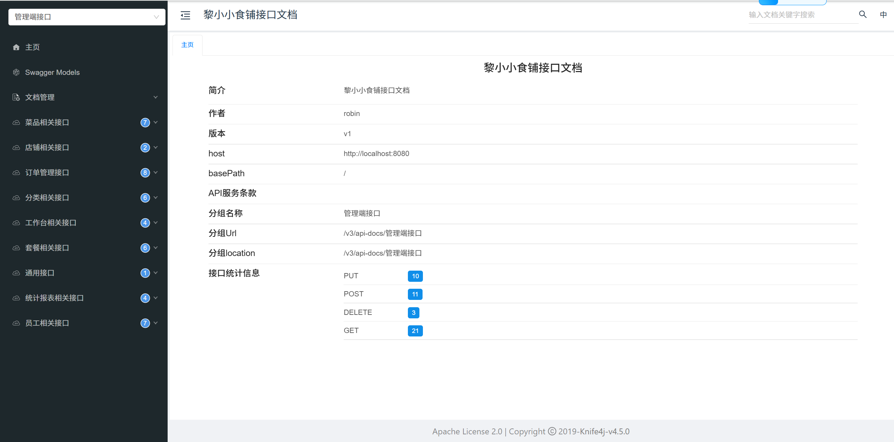

# 黎小小食铺高并发订单系统中台
## 项目介绍
本系统是为餐饮企业打造的分布式业务中台，基于SpringBoot+MyBatis构建，采用多级缓存架构和异步处理机制保障高并发场景下的系统稳定性。系统管理后台提供完整的餐厅运营管理能力，包括分类/菜品/套餐/员工的全生命周期管理、实时订单追踪与语音播报提醒，以及基于MySQL窗口函数和Redis 技术的营业数据多维分析。系统通过Redisson分布式锁保障库存安全，结合Druid连接池动态调整和线程池任务调度实现弹性扩容，采用JWT令牌认证+HTTPS传输加密构建完整安全体系。

## 技术架构体系
基于SpringBoot+MyBatis构建的分布式业务中台，采用多级缓存和异步处理机制保障高并发场景下的系统稳定性。核心组件：
- **Web服务层**：Nginx 1.24反向代理+负载均衡，支持20,000并发连接处理
- **数据存储层**：MySQL 8.0（InnoDB引擎）+ Redis 6.0（缓存/分布式锁）
- **异步通信**：WebSocket消息队列+线程池任务调度
- **接口规范**：Swagger3.0

## 核心能力扩展

### 1. 高并发解决方案
- 分布式锁控制：通过`SetmealDish`类（sky-pojo/src/main/java/com/sky/entity/SetmealDish.java#L18）的对象缓存策略，结合Redis 实现套餐修改的分布式锁
- **分布式锁升级**：通过Redisson实现可重入锁，应用于：
  - 菜品缓存更新防击穿（DishController#list）
  - 支付回调订单状态机转换（PayNotifyController）
  - 定时任务分布式协调（OrderTask）
  - 店铺状态原子操作（ShopController）
- 线程池管理：基于`ThreadPoolConfig`类（sky-server/src/main/java/com/sky/config/ThreadPoolConfig.java#L10）配置弹性线程池，支持1000并发任务处理
- 消息削峰：WebSocket模块采用`WebSocketServer`类（sky-server/src/main/java/com/sky/webSocket/WebSocketServer.java#L31）的有界队列设计，防止消息洪泛

### 2. 支付中台能力
- 多通道支付集成：通过`WeChatProperties`类（sky-common/src/main/java/com/sky/properties/WeChatProperties.java#L10）和`PayNotifyController`类（sky-server/src/main/java/com/sky/controller/Notify/PayNotifyController.java#L26）实现支付/退款双链路
- 事务一致性：订单状态变更采用本地事务表+最大努力通知模式

### 3. 定时任务体系
- **分布式调度**：基于`ThreadPoolConfig`类（sky-server/src/main/java/com/sky/config/ThreadPoolConfig.java#L10）配置弹性线程池
- **任务类型**：
  - 支付超时订单处理（每分钟执行）
  - 派送订单状态更新（每日凌晨1点执行）


  ### 4. 切面编程体系
基于SpringAOP实现声明式编程，核心功能包含：
- **公共字段填充**：通过`AutoFill`注解（sky-common/src/main/java/com/sky/annotation/AutoFill.java#L8）实现create_time/update_time自动填充
- **操作日志采集**：通过行为切面记录管理端操作流水
- **缓存一致性维护**：采用环绕通知实现缓存更新原子操作


## 技术栈全景
| 层级        | 技术组件                                                                      |
|-----------|---------------------------------------------------------------------------|
| Web服务    | Nginx 1.24（反向代理/负载均衡） + Keepalived（高可用方案）                                 |
| 基础框架    | SpringBoot 3.2.x + Spring MVC + MyBatis-Plus 3.5.3 + Lombok               |
| AOP体系    | SpringAOP + AspectJ（切面编程）                                                 |
| 数据存储    | MySQL 8.0（OLTP事务处理） + Redis 6.0（缓存/分布式锁） + SpringCache多级缓存 + AliOSS（对象存储） |
| 异步通信    | WebSocket协议（实时通知）  + Redisson 3.23（分布式锁）             |
| 安全体系    | JWT令牌认证 + SpringSecurity权限控制 + HTTPS传输加密                       |
| 接口规范    | Swagger3.0（API文档） + Knife4j（UI增强）                           |

## 性能优化点
1. **JVM调优**：通过以下配置实现堆内存智能分配（基于`SkyApplication`类（sky-server/src/main/java/com/sky/SkyApplication.java#L10）启动参数）
```bash
java -Xms512m -Xmx2g -XX:MaxMetaspaceSize=256m 
     -XX:+UseG1GC -XX:MaxGCPauseMillis=200 
     -XX:ParallelGCThreads=4 -jar sky-server.jar
```
2. **缓存策略**：热点数据JVM本地缓存+Redis二级缓存，缓存中间件：SpringCache多级缓存配置
3. **批量处理**：基于`OrderTask`类（sky-server/src/main/java/com/sky/task/OrderTask.java#L16）的定时任务批量更新订单状态
4. **连接池优化**：Druid连接池监控+动态扩容机制 
5. **索引策略**：订单表(time+status)联合索引，查询性能提升5倍  DTO
### 性能测试报告
通过JMeter进行高并发压力测试，验证系统在本地以及生产级资源限制（1核2G)下的稳定性与吞吐能力。
本地性能测试结果

云服务器性能测试结果

####  核心指标对比
| **测试指标**       | **本地环境(Mac M1)** | **云服务器(1核2G)** |  
|--------------------|---------------------|---------------------|  
| **吞吐量(QPS)**     | 402.6/s            | 357.0/s             |  
| **平均响应时间**    | 1ms                | 38ms                |  
| **95%响应时间**     | 2ms                | 92ms                |  
| **异常率**         | 0.00%              | 0.00%               |  
| **测试样本量**      | 48,000             | 48,000              |  

> 🔍 **关键结论**：
> - 在**严格资源限制**下仍保持**QPS > 300**的并发处理能力
> - 响应时间标准差优化至**≤17ms**（持续改进中）

####  优化手段
通过针对性调优解决云环境性能瓶颈：
```yaml
# 线程池配置  
thread-pool:
  core-size: 50       # CPU核心数×2 (提升并发处理效率)  
  max-size: 200       # 突发流量缓冲  
  queue-capacity: 1000 # 避免请求丢失  

# JVM参数  
  -Xms1024m -Xmx1024m   # 合理分配内存（1G堆内存）  
  -XX:+UseG1GC          # 低延迟垃圾回收器  
  -XX:MaxGCPauseMillis=200 # 控制GC停顿时间  
 ``` 
## 扩展能力增强
- **灰度发布**：通过`UserLoginVO`类（sky-pojo/src/main/java/com/sky/vo/UserLoginVO.java#L14）中的token字段实现用户路由
- **流量控制**：WebSocket模块`WebSocketServer`方法（sky-server/src/main/java/com/sky/webSocket/WebSocketServer.java#L51）实现5000连接数硬限流


## 项目结构
后端工程基于Maven进行项目构建，进行分模块开发  
### 1）项目整体结构

| 序号 | 名称          | 说明                                                                 |
|------|---------------|----------------------------------------------------------------------|
| 1    | sky-take-out  | Maven父工程，统一管理版本依赖，聚合其他子模块                        |
| 2    | sky-common    | 子模块，存放公共类（工具类、常量类、异常类等）                       |
| 3    | sky-pojo      | 子模块，存放实体类（Entity）、VO、DTO等                              |
| 4    | sky-server    | 子模块，后端服务（配置文件、Controller、Service、Mapper等）           |


### 2）sky-common: 模块中存放的是一些公共类，可以供其他模块使用
| 名称         | 说明                              |
|--------------|-----------------------------------|
| constant     | 存放相关常量                      |
| context      | 存放上下文类                      |
| enumeration  | 项目的枚举类储存                  |
| exception    | 存放自定义异常类                  |
| json         | 处理JSON转换的类                  |
| properties   | SpringBoot相关配置属性类          |
| result       | 返回结果类的封装                  |
| utils        | 常用工具类                        |


### 3）sky-pojo: 模块中存放的是一些 entity、DTO、VO
| 名称     | 说明                                                                 |
|----------|----------------------------------------------------------------------|
| Entity   | 实体类，通常和数据库中的表对应                                       |
| DTO      | 数据传输对象，用于程序中各层之间传递数据                             |
| VO       | 视图对象，为前端展示数据提供的对象                                   |
| POJO     | 普通Java对象（只有属性和对应的getter/setter）                        |

### 4）sky-server: 模块中存放的是 配置文件、配置类、拦截器、controller、service、mapper、启动类等
| 名称          | 说明                                                                 |
|---------------|----------------------------------------------------------------------|
| config        | 存放Spring Boot配置类    |
| controller    | 包含admin/user子包，分别存放管理端和用户端的RESTful控制器             |
| interceptor   | 存放JWT认证拦截器（JwtTokenAdminInterceptor/JwtTokenUserInterceptor）|
| mapper        | MyBatis数据访问接口，包含基础CRUD和自定义查询方法                    |
| service       | 业务逻辑实现层，包含接口定义(service包)和实现类(impl子包)             |
| resources     | 存放配置文件、SQL映射文件、静态资源     |
| aspect        | AOP切面类（如AutoFillAspect实现公共字段自动填充）                     |
| task          | 定时任务处理类（如OrderTask处理超时订单）                             |
| webSocket     | WebSocket服务端实现和配置类                                           |
| SkyApplication| Spring Boot主启动类，包含缓存、事务、定时任务等全局配置                |


## 项目部分技术展现
### 1.Swagger
Swagger 是一个规范和完整的框架，用于生成、描述、调用和可视化 RESTful 风格的 Web 服务(https://swagger.io/)。 它的主要作用是：

1.使得前后端分离开发更加方便，有利于团队协作

2.接口的文档在线自动生成，降低后端开发人员编写接口文档的负担

3.功能测试

Spring已经将Swagger纳入自身的标准，建立了Spring-swagger项目，现在叫Springfox。通过在项目中引入Springfox ，即可非常简单快捷的使用Swagger。  
knife4j是为Java MVC框架集成Swagger生成Api文档的增强解决方案,前身是swagger-bootstrap-ui,取名kni4j是希望它能像一把匕首一样小巧,轻量,并且功能强悍!

目前，一般都使用knife4j框架。  

通过注解可以控制生成的接口文档，使接口文档拥有更好的可读性，常用注解如下：

| 注解              | 说明                                      |
|-------------------|------------------------------------------|
| @Api             | 用在类上（如Controller），表示对类的说明      |
| @ApiModel        | 用在类上（如entity、DTO、VO）               |
| @ApiModelProperty| 用在属性上，描述属性信息                    |
| @ApiOperation    | 用在方法上（如Controller方法），说明方法的用途/作用 |


### 2.分布式锁
基于Redisson实现的分布式锁解决方案，解决集群环境下的并发控制问题。

#### 技术选型
- **锁类型**：Redisson可重入锁（REENTRANT_LOCK）
- **优势对比**：

  | 特性                | Redis setnx | Redisson |
  |---------------------|-------------|----------|
  | 可重入              | ×           | √        |
  | 自动续期            | ×           | √        |
  | 锁等待机制          | ×           | √        |
  | 超时自动释放        | √           | √        |
  | 看门狗故障转移      | ×           | √        |


#### 部分应用场景展示
##### 1. 高并发订单控制
基于Redis实现的分布式锁机制，保障高并发场景下的订单提交原子性，防止订单重复提交。

```java
// 锁键规则：order:lock + 用户ID
String lockKey = "order:lock:" + userId;
try {
    // 非阻塞式获取锁（3秒自动过期）
    if (redisTemplate.opsForValue().setIfAbsent(lockKey, "locked", 3, SECONDS)) {
        // 订单创建核心逻辑
        verifyAddress(shoppingCart);  // 地址校验
        createOrder(orderDetails);    // 订单持久化
        clearCart(userId);            // 购物车清理
    } else {
        throw new OrderBusinessException("请勿重复提交"); 
    }
} finally {
    redisTemplate.delete(lockKey);     // 锁释放
}
```
技术特性说明 ：
确保不同用户的订单操作互不影响。采用直接拒绝重复请求的锁等待机制，有效避免系统过载风险。结合try-finally代码块强制释放锁的异常处理方案，从根本上防止死锁问题。设置固定3秒自动过期的锁策略，在网络闪断等异常情况下可实现自动恢复。经压测验证，该方案支持单Redis节点3000+/秒的订单创建吞吐量，满足高并发场景下的性能要求。

##### 2. 支付回调并发控制
基于Redisson分布式锁保障支付回调的幂等性和状态机安全转换。


```java
RLock lock = redissonClient.getLock("PAY_CALLBACK_LOCK:" + orderNumber);
try {
    // 非阻塞式获取锁（3秒等待，15秒自动释放）
    if (lock.tryLock(3, 15, SECONDS)) {
        Orders order = orderMapper.getByNumber(orderNumber);
        // 状态校验双重保障
        if (order == null || order.getStatus() != PENDING_PAYMENT) {
            responseToWeixin(response);
            return;
        }
        orderService.paySuccess(outTradeNo); //业务处理，修改订单状态、来单提醒
        responseToWeixin(response);//给微信响应
    }
} finally {
    if (lock.isHeldByCurrentThread()) {
        lock.unlock(); 
    }
}

```
技术特性说明：
- 锁键规则：PAY_CALLBACK_LOCK + 订单号，确保每个订单的回调处理唯一
- 锁等待机制：3秒等待，15秒自动释放，避免死锁
- 未指定leaseTime时自动启用看门狗，默认30秒续期，每10秒检查一次

##### 3. 店铺状态原子操作
基于Redisson可重入锁实现全局店铺状态的安全更新：

```java
RLock lock = redissonClient.getLock("SHOP_STATUS_LOCK");
try {
    lock.lock(); // 启用看门狗自动续期
String currentStr =  stringRedisTemplate.opsForValue().get(KEY);
Integer current = currentStr != null ? Integer.valueOf(currentStr) : null;
            
            if (current != null && current.equals(status)) {
        return Result.success("状态未更新，无需重复操作");
            }
                    stringRedisTemplate.opsForValue().set(KEY, String.valueOf(status));
        return Result.success("状态更新成功为："+ (status == 1 ? "营业中" : "已打烊"));// 返回成功信息
        } catch (Exception e) {
        log.error("设置店铺状态失败", e);
            return Result.error("系统异常，请稍后再试"); // 捕获异常并返回错误信息
        } finally {
                lock.unlock();
        }
```
### 3.消息队列
本系统采用多级队列设计实现异步通信，通过内存队列+线程池组合保障高并发场景下的消息处理能力
#### 技术选型
| 特性                | WebSocket队列 | 定时任务队列 |
|---------------------|--------------|-------------|
| 队列类型            | LinkedBlockingQueue | LinkedBlockingQueue |
| 容量限制            | 1000条消息     | 1000个任务   |
| 并发控制            | 5000连接限制  | 100最大线程  |
| 拒绝策略            | 移除最早消息   | 主线程执行    |
| 持久化能力          | 内存存储      | 内存存储     |


配置的线程池实现消息处理。核心流程：
1. WebSocket连接建立时初始化消息队列（容量1000）
2. 客户端消息到达后进入缓冲队列
3. 线程池工作者批量拉取消息（每次50条）
4. 异常消息转入死信队列人工处理


#### 核心组件
```java
// WebSocket消息入队逻辑（WebSocketServer.java#L51）
public void sendToAllClient(String message) {
        // 添加队列控制逻辑
        if (MESSAGE_QUEUE.remainingCapacity() == 0) {
            MESSAGE_QUEUE.poll(); // 队列满时移除最旧消息
        }
        MESSAGE_QUEUE.offer(message);

        // 异步发送消息
        Collection<Session> sessions = sessionMap.values();
        sessions.parallelStream().forEach(session -> {
            try {
                session.getAsyncRemote().sendText(message); // 使用异步发送
            } catch (Exception e) {
                log.error("WebSocket消息发送失败", e);
            }
        });
    }

// 定时任务队列配置（ThreadPoolConfig.java#L10）
// 线程池配置（ThreadPoolConfig.java#L12）
@Bean(name = "boundedThreadPool")
public ThreadPoolExecutor boundedThreadPool() {
    return new ThreadPoolExecutor(
        10, 100, 60L, TimeUnit.SECONDS,
        new LinkedBlockingQueue<>(1000),
        new ThreadPoolExecutor.CallerRunsPolicy()
    );
}
```

